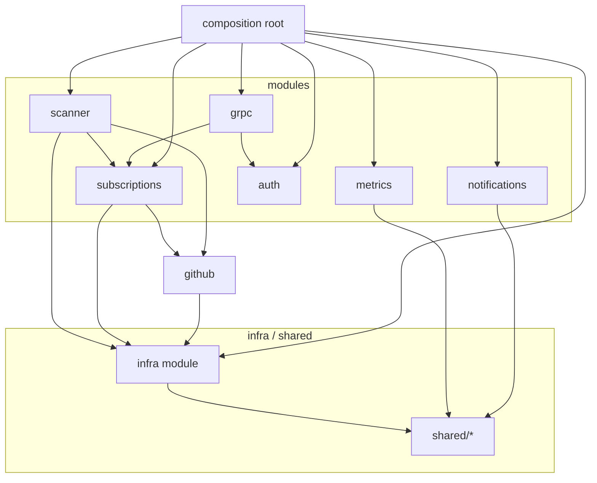

# Module Boundaries

## Overview

This service is a **modular monolith**: all feature modules run in a single process,
partitioned by domain with explicit public APIs and enforced dependency rules.
Phase 3 of the roadmap extracts the `notifications` module into a separate microservice
with an HTTP + gRPC API; the boundary rules are already drawn to make that extraction
straightforward.

Boundaries are enforced automatically by
[dependency-cruiser](https://github.com/sverweij/dependency-cruiser) via
`.dependency-cruiser.cjs`, which runs as part of `npm run lint` on every check.

---

## Module Table

| Module | Public API (`index.ts`) | May depend on |
|---|---|---|
| `github` | `GITHUB_SERVICE` token / `IGitHubService` | `infra` (METRICS, REDIS), `shared/*` |
| `subscriptions` | `SUBSCRIPTION_SERVICE` / `ISubscriptionService`; `SUBSCRIPTION_REPO`, `REPO_REPO` tokens; `ISubscriptionRepository`, `IRepoRepository`; `subscriptionRoutes` | `github` (via token), `infra` (PRISMA, EVENT_BUS), `shared/*` |
| `scanner` | `SCANNER_SERVICE` / `IScannerService`; `SCANNER_QUEUE`; `buildScannerWorker`; `buildScannerScheduler` | `subscriptions` (SUBSCRIPTION_REPO, REPO_REPO tokens), `github` (GITHUB_SERVICE token), `infra` (EVENT_BUS, METRICS), `shared/*` |
| `notifications` | `NotificationService`; `NotificationHandlers` / `registerNotificationHandlers`; `buildNotificationWorker`; `NOTIFICATION_QUEUE`; `MockEmailProvider`, `ResendEmailProvider` | `shared/events`, `shared/metrics`, `shared/queue` — **no** feature-module deps |
| `grpc` | `buildGrpcServer` / `startGrpcServer`; `GrpcProxyService` / `IGrpcProxyService`; `grpcProxyRoutes` | `subscriptions` (ISubscriptionService), `auth` (createApiKeyGuard), `shared/*` |
| `auth` | `createApiKeyGuard` | none (leaf) |
| `metrics` | `metricsRoutes` | `shared/metrics` |
| `infra` (`src/infrastructure/infra.module.ts`) | `PRISMA`, `REDIS`, `BULLMQ`, `METRICS`, `EVENT_BUS` tokens; `registerInfraModule`; `createInfraInstances` | none (`shared/*` only — leaf) |

> **Corrections vs. briefed list:**
> - `grpc` also depends on `auth` (`grpc-proxy.routes.ts` imports `createApiKeyGuard`).
> - `scanner` resolves `SUBSCRIPTION_REPO` and `REPO_REPO` directly (not `SUBSCRIPTION_SERVICE`).
> - `notifications` has no formal `*.module.ts`; it is wired entirely in the composition root
>   and depends only on `shared/*`, not on other feature modules.

---

## Public-API Mechanism

Each module exposes a **tsyringe DI token** (a typed `Symbol`) paired with a
**TypeScript interface** from its `*.module.ts` or `index.ts`:

```
// Example — github.module.ts
export const GITHUB_SERVICE: InjectionToken<IGitHubService> = Symbol('GITHUB_SERVICE');
export interface IGitHubService { ... }
```

Concrete classes (`GitHubService`, etc.) are internal to the module — they are never
re-exported.

`build*` / `register*` factory functions register the concrete classes against their
tokens in the DI container. The composition root (`src/composition/container.ts`) calls
every `register*` function and holds the only reference to concrete implementations.

Cross-module code depends on the interface via the token:

```
dep.resolve<IGitHubService>(GITHUB_SERVICE)
```

This means any two feature modules are coupled only through typed interfaces, not through
implementation classes or file paths.

---

## Enforced Rules

The five rules in `.dependency-cruiser.cjs`:

| Rule | What it forbids | Why |
|---|---|---|
| `no-cross-module-deep-import` | Importing internal files of another module (anything below its `index.ts` or `*.module.ts`) | Forces consumers to use the declared public API; module internals can be refactored freely |
| `modules-no-composition` | Feature modules importing from `src/composition/` or `src/services/`, **except** `composition/tokens.ts` | The composition root is the only place that wires the graph; modules must not reach up into it. `tokens.ts` is a shared-constants file (plain `Symbol` declarations) that modules legitimately reference to resolve their own dependencies |
| `shared-is-leaf` | `src/shared/**` importing from `src/modules/**` | `shared/` is cross-cutting infrastructure; making it depend on features would create circular coupling and prevent reuse |
| `no-circular` | Any circular dependency chain | Circular deps cause unpredictable init order and make modules impossible to extract independently |
| `no-orphans` *(warn)* | Source files with no importers and no imports (excluding `index.ts` and `.d.ts`) | Flags dead code and forgotten files; warn rather than error to allow transient states during development |

---

## How to Run

```bash
# Check for violations (runs automatically as part of `npm run lint`)
npm run lint:boundaries

# Regenerate the dot graph
npm run boundaries:graph
```

---

## Dependency Graph

The diagram below shows the **allowed** dependency directions between the main
architectural zones. Arrows point from dependent to dependency.



The authoritative auto-generated graph is in [`deps.dot`](deps.dot).
Render it with Graphviz when available:

```bash
dot -T svg docs/architecture/deps.dot -o docs/architecture/deps.svg
```
