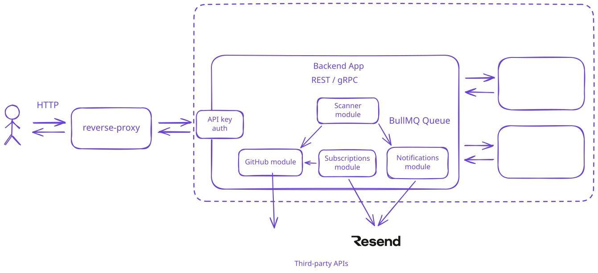

# Software Design Document  
## GitHub Release Notification Service

**Version:** 1.0  
**Date:** 2026-05-08  
**Author:** Volodymyr Antoniuk  

---

## Table of Contents

1. [Introduction](#1-introduction)
2. [System Overview](#2-system-overview)
3. [Architecture](#3-architecture)
4. [Module Design](#4-module-design)
5. [Data Model](#5-data-model)
6. [API Design](#6-api-design)
7. [Background Job Design](#7-background-job-design)
8. [Caching Strategy](#8-caching-strategy)
9. [Authentication & Security](#9-authentication--security)
10. [Error Handling](#10-error-handling)
11. [Observability](#11-observability)
12. [Infrastructure & Deployment](#12-infrastructure--deployment)
13. [Testing Strategy](#13-testing-strategy)
14. [Key Design Decisions](#14-key-design-decisions)

---

## 1. Introduction

### 1.1 Purpose

This document describes the software design of the **GitHub Release Notification Service** — a backend API that allows users to subscribe to GitHub repository releases and receive email notifications when new releases are published.

### 1.2 Scope

The system covers:
- User subscription management (subscribe, confirm, unsubscribe, list)
- Periodic polling of the GitHub API to detect new releases
- Email delivery for both subscription confirmation and release notifications
- REST and gRPC interfaces
- A minimal browser-based web UI

### 1.3 Goals

| Goal | Description |
|------|-------------|
| Double opt-in | Users must confirm their email before receiving notifications |
| Reliable delivery | Email jobs are queued and retried on failure |
| GitHub rate-limit awareness | The scanner backs off gracefully when rate limits are hit |
| Horizontal readiness | Stateless service process; state lives in PostgreSQL and Redis |
| Observability | Prometheus metrics exposed for every meaningful operation |

### 1.4 Out of Scope

- GitHub webhook integration (polling is used instead)
- Multi-provider email (Resend is the only provider)
- User accounts or OAuth
- Release filtering (all releases trigger a notification)

---

## 2. System Overview

### 2.1 High-Level Flow



### 2.2 User Lifecycle

```
POST /api/subscribe
        │
        ▼
  Subscription created (confirmed=false)
  Confirmation email enqueued
        │
        ▼ (user clicks link in email)
GET /api/confirm/:token
        │
        ▼
  confirmed=true, confirmToken cleared
        │
        ▼ (scanner detects new release)
  release-notification job enqueued
        │
        ▼
  Release email delivered
        │
        ▼ (user clicks unsubscribe link)
GET /api/unsubscribe/:token
        │
        ▼
  Subscription deleted
```

---

## 3. Architecture

### 3.1 Architectural Style

The service is a **modular monolith** deployed as a single process. Each feature domain is isolated into its own module directory under `src/modules/`. 

This was chosen over a microservice split to reduce operational complexity at current scale while keeping module boundaries explicit enough for a future split if needed. See [ADR 002](../adr/002-modular-monolith.md).

### 3.2 Module Map

```
src/
├── main.ts                  — application bootstrap, DI wiring
├── app.ts                   — Fastify factory, plugin registration
├── config/                  — env config, logger
├── infrastructure/
│   ├── db/                  — Prisma client singleton
│   ├── redis/               — node-redis client
│   └── queue/               — IORedis connection (BullMQ)
├── modules/
│   ├── github/              — GitHub API client, cache, service
│   ├── subscriptions/       — REST routes, service, repository, schemas
│   ├── scanner/             — polling scheduler, worker, service
│   ├── notifications/       — email provider, templates, BullMQ worker
│   ├── grpc/                — gRPC server, browser proxy routes
│   ├── auth/                — API key middleware plugin
│   └── metrics/             — Prometheus counters/histograms, /metrics route
├── shared/
│   ├── errors/              — AppError hierarchy, Fastify error handler
│   └── utils/               — token generator, validation helpers
└── public/                  — static HTML pages (subscribe, confirm, unsubscribe)
```

---

## 4. Module Design

### 4.1 GitHub Module (`src/modules/github/`)

**Responsibility:** Validate that a GitHub repository exists and retrieve its latest release.

| File | Role |
|------|------|
| `github.client.ts` | Raw HTTP calls to `api.github.com` using native `fetch` |
| `github.cache.ts` | Redis-backed cache layer wrapping the client |
| `github.service.ts` | Public facade consumed by other modules |
| `github.types.ts` | `GitHubRepo`, `GitHubRelease`, `GitHubRateLimitHeaders` interfaces |

**Rate Limit Handling:**  
Every response from the client inspects `X-RateLimit-Remaining`. When fewer than 5 requests remain, a `RateLimitError` is thrown with `retryAfter` derived from `X-RateLimit-Reset`. HTTP 429 and 403 responses are mapped to the same error type.

**Cache Keys and TTL:**

| Key pattern | Default TTL |
|-------------|-------------|
| `github:repo:{owner}/{name}` | `GH_CACHE_TTL_SECONDS` (600 s) |
| `github:release:{owner}/{name}` | `GH_CACHE_TTL_SECONDS` (600 s) |

The scanner always bypasses the release cache (`bypassCache: true`) so it sees the real latest release on every scan cycle.

### 4.2 Subscriptions Module (`src/modules/subscriptions/`)

**Responsibility:** Core business logic for the subscription lifecycle.

**subscription.service.ts — method contracts:**

| Method | Preconditions | Side Effects |
|--------|--------------|--------------|
| `subscribe(email, repo)` | valid format, repo exists on GitHub, no duplicate | creates `Repo` (upsert), creates `Subscription`, enqueues `confirmation` job |
| `confirm(token)` | token is 43-char base64url, exists in DB | sets `confirmed=true`, nulls `confirmToken` |
| `unsubscribe(token)` | token is 43-char base64url, exists in DB | deletes `Subscription` row |
| `getSubscriptions(email)` | valid email format | returns confirmed subscriptions with repo data |

**subscription.repository.ts — key queries:**

| Method | Query |
|--------|-------|
| `findOrCreateRepo` | `upsert` on `(owner, name)` — idempotent |
| `findDistinctConfirmedRepos` | repos that have ≥1 confirmed subscriber |
| `findAllConfirmedByRepoId` | all confirmed emails for a repo (used by scanner) |
| `updateRepoLastSeenTag` | single write per release event |

**Token Design:**  
Both tokens are 32 random bytes encoded as `base64url` → 43 characters.  
- `confirmToken`: one-time use, set to `null` after confirmation.  
- `unsubscribeToken`: permanent, included in every release email.

### 4.3 Scanner Module (`src/modules/scanner/`)

**Responsibility:** Periodically poll GitHub for new releases and trigger notifications.

**scanner.scheduler.ts:**  
Creates a single BullMQ repeatable job `scan-releases` with interval `SCAN_INTERVAL_MS` (default 30 000 ms, effectively used as 5 min in production). On startup the scheduler removes any existing job before adding a new one — making repeated restarts idempotent.

**scanner.worker.ts:**  
BullMQ worker with `concurrency: 1`. Only one scan runs at a time, preventing double-notifications if a scan takes longer than the interval.

> **Multi-instance limitation:** `concurrency: 1` prevents overlapping scans within a single process. Running multiple instances simultaneously (horizontal scaling) would cause each instance to run independent scans and send duplicate notifications. A distributed lock (e.g., Redis-based) would be required to support horizontal scaling safely. This is a known limitation and out of scope for the current implementation.

**scanner.service.ts — scan algorithm:**

```
for each repo with ≥1 confirmed subscription:
  latestRelease = githubService.getLatestRelease(owner, name, bypassCache=true)
  if repo.lastSeenTag is null OR latestRelease.tag_name ≠ repo.lastSeenTag:
    update repo.lastSeenTag = latestRelease.tag_name
    for each confirmed subscriber email:
      enqueue release-notification job
  if RateLimitError:
    log warning, break scan loop (resumes on next tick)
```

`lastSeenTag` is stored once per `Repo` row (not per `Subscription`) to avoid O(N) writes proportional to subscriber count. See [ADR 004](../adr/004-last-seen-tag.md).

### 4.4 Notifications Module (`src/modules/notifications/`)

**Responsibility:** Send transactional emails via the Resend API.

| File | Role |
|------|------|
| `email.provider.ts` | `EmailProvider` interface (`sendEmail(to, subject, html)`) |
| `resend.provider.ts` | Concrete Resend implementation |
| `notification.service.ts` | Composes and dispatches confirmation and release emails |
| `notification.worker.ts` | BullMQ worker processing `confirmation` and `release-notification` jobs |
| `templates/confirmation.ts` | HTML for confirmation email |
| `templates/release.ts` | HTML for release notification email |

**Job Types:**

| Job name | Payload | Retry |
|----------|---------|-------|
| `confirmation` | `{ email, confirmUrl }` | 3 attempts, 2 s exponential backoff |
| `release-notification` | `{ email, owner, name, tag, releaseName, publishedAt, releaseUrl, unsubscribeUrl }` | 3 attempts, 2 s exponential backoff |

### 4.5 gRPC Module (`src/modules/grpc/`)

**Responsibility:** Expose the same subscription operations over gRPC and provide a browser-friendly HTTP proxy.

**Service definition** (`proto/subscription.proto`):

```protobuf
service SubscriptionService {
  rpc Subscribe(SubscribeRequest) returns (SubscribeResponse);
  rpc Confirm(TokenRequest) returns (MessageResponse);
  rpc Unsubscribe(TokenRequest) returns (MessageResponse);
  rpc GetSubscriptions(GetSubscriptionsRequest) returns (SubscriptionListResponse);
}
```

**Authentication:** gRPC calls must include an `x-api-key` metadata header. The server validates it against `API_KEY` from config.

**Error Mapping:**

| AppError | gRPC Status |
|----------|-------------|
| `ValidationError` | `INVALID_ARGUMENT` |
| `NotFoundError` | `NOT_FOUND` |
| `ConflictError` | `ALREADY_EXISTS` |
| `RateLimitError` | `RESOURCE_EXHAUSTED` |

**gRPC Proxy** (`grpc-proxy.routes.ts`):  
`POST /api/grpc-proxy` accepts `{ method, payload }` JSON and forwards to the local gRPC server. This enables the browser UI (which cannot speak raw gRPC) to use gRPC semantics.

### 4.6 Metrics Module (`src/modules/metrics/`)

Prometheus metrics registered with `prom-client`:

| Metric | Type | Description |
|--------|------|-------------|
| `http_requests_total` | Counter | HTTP requests by method, route, status |
| `http_request_duration_seconds` | Histogram | Request latency by route |
| `github_api_calls_total` | Counter | GitHub API calls by endpoint |
| `notifications_sent_total` | Counter | Emails sent by type |
| `new_releases_detected_total` | Counter | New releases found per scan |
| `scan_releases_total` | Counter | Total repos scanned |
| `active_subscriptions` | Gauge | Current confirmed subscription count |

The `active_subscriptions` gauge is updated on subscription lifecycle events: incremented on `GET /api/confirm/:token` (subscription confirmed), decremented on `GET /api/unsubscribe/:token` (subscription removed). It reflects delta changes since process start, not an absolute DB count.

Exposed at `GET /api/metrics` in Prometheus text format.

---

## 5. Data Model

### 5.1 Entity-Relationship Diagram

```
┌──────────────────────────────┐       ┌──────────────────────────────────────┐
│            Repo               │       │           Subscription                │
├──────────────────────────────┤       ├──────────────────────────────────────┤
│ id          UUID  PK         │◄──────│ id              UUID  PK             │
│ owner       VARCHAR          │       │ email           VARCHAR               │
│ name        VARCHAR          │       │ repoId          UUID   FK → Repo.id   │
│ lastSeenTag VARCHAR?         │       │ confirmed       BOOLEAN DEFAULT false │
│ createdAt   TIMESTAMP        │       │ confirmToken    VARCHAR? UNIQUE       │
│ updatedAt   TIMESTAMP        │       │ unsubscribeToken VARCHAR  UNIQUE      │
└──────────────────────────────┘       │ createdAt       TIMESTAMP             │
                                       └──────────────────────────────────────┘
UNIQUE: (owner, name)                  UNIQUE: (email, repoId)
                                       INDEX: email
```

### 5.2 State Machine: Subscription

```
[created] confirmed=false, confirmToken=<value>
     │
     │ GET /api/confirm/:token
     ▼
[active]  confirmed=true,  confirmToken=null
     │
     │ GET /api/unsubscribe/:token
     ▼
[deleted] (row removed)
```

### 5.3 Constraints

| Constraint | Enforcement |
|------------|-------------|
| One subscription per (email, repo) | DB UNIQUE + service-level ConflictError |
| `confirmToken` is single-use | set to `null` on first use |
| `unsubscribeToken` is permanent | never rotated |
| `lastSeenTag` null = never scanned | first scan always triggers update |

**`lastSeenTag = null` behavior (intentional):** When a repository is first added, `lastSeenTag` is `null`. The first scan will always treat this as a new release and notify all confirmed subscribers of the current latest release. This is intentional — it ensures subscribers receive an immediate notification about the most recent release after their subscription is confirmed.

**`unsubscribeToken` security tradeoff (accepted risk):** The token is a 256-bit random value stored in plaintext, included in every release notification email. It is long-lived and never rotated. Tradeoff: simple stateless unsubscribe links vs. inability to invalidate a leaked token. Token rotation and expiry are out of scope for this implementation.

---

## 6. API Design

### 6.1 REST Endpoints

All endpoints are prefixed `/api`. Swagger UI is available at `/docs`.

| Method | Path | Auth | Description |
|--------|------|------|-------------|
| `POST` | `/api/subscribe` | API Key | Create a new subscription |
| `GET` | `/api/confirm/:token` | — | Confirm email address |
| `GET` | `/api/unsubscribe/:token` | — | Remove subscription |
| `GET` | `/api/subscriptions` | API Key | List confirmed subscriptions for an email |
| `GET` | `/api/metrics` | — | Prometheus metrics |
| `POST` | `/api/grpc-proxy` | API Key | Browser-to-gRPC proxy |

#### POST /api/subscribe

**Request:**
```json
{ "email": "user@example.com", "repo": "owner/repo" }
```

**Validation:**
- `email`: RFC-5321 format
- `repo`: matches `^[a-zA-Z0-9._-]+/[a-zA-Z0-9._-]+$`

**Responses:**

| Status | Condition |
|--------|-----------|
| 201 | Subscription created, confirmation email sent |
| 400 | Invalid email or repo format |
| 404 | GitHub repository not found |
| 409 | Subscription already exists for this (email, repo) |
| 429 | GitHub API rate limit reached |

#### GET /api/confirm/:token

| Status | Condition |
|--------|-----------|
| 200 | Confirmed successfully |
| 400 | Invalid token format |
| 404 | Token not found or already used |

#### GET /api/unsubscribe/:token

| Status | Condition |
|--------|-----------|
| 200 | Unsubscribed successfully |
| 400 | Invalid token format |
| 404 | Token not found |

#### GET /api/subscriptions?email=

| Status | Condition |
|--------|-----------|
| 200 | Array of confirmed subscriptions (may be empty) |
| 400 | Invalid email format |

**Response shape:**
```json
[
  {
    "id": "uuid",
    "email": "user@example.com",
    "confirmed": true,
    "repo": {
      "owner": "facebook",
      "name": "react",
      "lastSeenTag": "v19.0.0"
    }
  }
]
```

### 6.2 Authentication

Protected endpoints require the header:
```
x-api-key: <API_KEY>
```
Missing or invalid key returns `401 Unauthorized`.

### 6.3 gRPC Interface

See section 4.5. The proto file is at `proto/subscription.proto`.

---

## 7. Background Job Design

### 7.1 Queue Infrastructure

Two logical BullMQ queues share a single IORedis connection:

| Queue | Producer | Consumer | Concurrency |
|-------|----------|----------|-------------|
| `notifications` | SubscriptionService, ScannerService | NotificationWorker | default |
| `scanner` | ScannerScheduler | ScannerWorker | 1 |

### 7.2 Job Lifecycle

```
Producer enqueues job
        │
        ▼
  BullMQ (Redis) — waiting
        │
        ▼
  Worker picks up — active
        │
    ┌───┴───┐
    │       │
    ▼       ▼
 success  failure
    │       │
    ▼       ▼
 complete  retry (up to 3×, exponential backoff starting at 2 s)
              │
              ▼ (after 3 failures)
           failed — kept in failed set (max 50 jobs)
```

### 7.3 Scanner Schedule

The `scan-releases` job is a BullMQ **repeatable job** with `every: SCAN_INTERVAL_MS`. On service startup:

1. Existing `scan-releases` repeatable job is removed (idempotent restart).
2. A fresh repeatable job is added.
3. The `ScannerWorker` starts with `concurrency: 1`.

This ensures exactly one scan runs at any time.

---

## 8. Caching Strategy

Redis is used exclusively as a **read cache** for GitHub API responses.

| Concern | Approach |
|---------|----------|
| Cache population | On first `getRepo` / `getLatestRelease` call, result written with TTL |
| Cache invalidation | TTL-based expiry only (no explicit invalidation) |
| Scanner bypass | Scanner always passes `bypassCache: true` to see real-time data |
| Redis unavailability | `try/catch` around all cache reads/writes; miss is treated as cache miss, not error |

The cache reduces GitHub API quota usage for the `verifyRepo` path (called on every subscribe) while not interfering with the scanner's need for fresh data.

---

## 9. Authentication & Security

### 9.1 API Key

A single shared `API_KEY` environment variable protects write and query endpoints. The key is validated by the `apiKeyPlugin` Fastify plugin attached per-route.

### 9.2 Token Security

| Token | Generation | Entropy | Use |
|-------|-----------|---------|-----|
| `confirmToken` | `crypto.randomBytes(32).toString('base64url')` | 256 bits | One-time email confirmation |
| `unsubscribeToken` | same | 256 bits | Permanent unsubscribe link |

Both tokens are stored in plaintext in the database (no hashing needed — they are not passwords; their only secret value is their unguessability).

### 9.3 Input Validation

All REST endpoints use Fastify's built-in JSON Schema validation. Regex patterns are applied server-side:
- `email`: RFC email pattern
- `repo`: `^[a-zA-Z0-9._-]+/[a-zA-Z0-9._-]+$`
- `token`: `^[A-Za-z0-9_-]{43}$`

Validation errors return `400` before reaching service logic.

### 9.4 CORS

CORS is enabled for all origins in the current configuration (`origin: true`), suitable for development. In production, restrict origins via the `CORS_ORIGINS` environment variable (comma-separated list of allowed origins). The current open configuration is intentional for the development/homework context and is a known deviation from production hardening.

---

## 10. Error Handling

### 10.1 Error Hierarchy

```
AppError (base)
├── ValidationError    → HTTP 400 / gRPC INVALID_ARGUMENT
├── NotFoundError      → HTTP 404 / gRPC NOT_FOUND
├── ConflictError      → HTTP 409 / gRPC ALREADY_EXISTS
└── RateLimitError     → HTTP 429 / gRPC RESOURCE_EXHAUSTED
                         (adds Retry-After header)
```

All `AppError` subclasses carry `isOperational: true`. Fastify's error handler logs and returns 500 for any non-operational error.

### 10.2 Error Response Shape

```json
{ "error": "Human-readable message" }
```

`RateLimitError` also adds `Retry-After: <seconds>` to the HTTP response headers.

---

## 11. Observability

### 11.1 Logging

Pino is used for structured JSON logging. In development, `pino-pretty` formats logs for readability. Log levels:
- `info`: normal operation events (server start, job complete, scan results)
- `warn`: degraded operation (rate limit hit, cache miss on Redis failure)
- `error`: failures with stack traces

### 11.2 Metrics

Prometheus metrics are scraped from `GET /api/metrics`. See section 4.6 for the full metric catalogue.

### 11.3 Health Indicators

No dedicated `/health` endpoint is implemented. Liveness can be inferred from HTTP responsiveness; readiness from database and Redis connectivity (both checked at startup).

---

## 12. Infrastructure & Deployment

### 12.1 Runtime Dependencies

| Component | Technology | Version |
|-----------|-----------|---------|
| Application | Node.js | 20 LTS |
| HTTP framework | Fastify | 4.x |
| Database | PostgreSQL | 16 |
| Cache / Queue broker | Redis | 7 |
| ORM | Prisma | 5.x |
| Queue | BullMQ | 5.x |
| Email | Resend API | — |

### 12.2 Environment Variables

| Variable | Required | Default | Description |
|----------|----------|---------|-------------|
| `DATABASE_URL` | Yes | — | PostgreSQL connection string |
| `REDIS_URL` | Yes | — | Redis connection string |
| `GITHUB_TOKEN` | Yes | — | GitHub personal access token |
| `RESEND_API_KEY` | Yes | — | Resend API key |
| `API_KEY` | Yes | — | Shared API key for protected endpoints |
| `PORT` | No | `3000` | HTTP server port |
| `GRPC_PORT` | No | `50051` | gRPC server port |
| `BASE_URL` | Yes | — | Public base URL (used in email links) |
| `NODE_ENV` | No | `development` | Affects logging and Swagger visibility |
| `SCAN_INTERVAL_MS` | No | `30000` | Release scan interval in milliseconds |
| `GH_CACHE_TTL_SECONDS` | No | `600` | GitHub API response cache TTL |

### 12.3 Docker Compose Topology

```
┌─────────────────────┐   ┌──────────────────┐   ┌──────────────────┐
│       app           │   │    postgres       │   │     redis        │
│  Node.js 20-alpine  │──▶│  PostgreSQL 16   │   │  Redis 7-alpine  │
│  Port 3000 (HTTP)   │   │  Port 5432       │   │  Port 6379       │
│  Port 50051 (gRPC)  │◀──│                  │   │                  │
└─────────────────────┘   └──────────────────┘   └──────────────────┘
          │                                                ▲
          └────────────────────────────────────────────────┘
```

### 12.4 Startup Sequence

1. Docker Compose health checks pass for PostgreSQL and Redis.
2. App container starts: `prisma migrate deploy` runs pending migrations.
3. `main.ts` connects to database and Redis.
4. BullMQ IORedis connection established.
5. `ScannerScheduler` registers repeatable job.
6. `ScannerWorker` and `NotificationWorker` start listening.
7. Fastify HTTP server binds to `PORT`.
8. gRPC server binds to `GRPC_PORT`.

### 12.5 Graceful Shutdown

On `SIGTERM` / `SIGINT`:
1. BullMQ workers drained and closed.
2. gRPC server stopped.
3. Fastify server closed.
4. Prisma client disconnected.
5. Redis client closed.
6. Process exits with code 0.

### 12.6 CI/CD

GitHub Actions pipeline (`.github/workflows/main.yml`) runs on push to `main` and on pull requests:

1. Spin up PostgreSQL 16 and Redis 7 service containers.
2. `npm ci`
3. `prisma generate`
4. `biome ci` (lint + format check)
5. `jest` (unit + integration tests with real DB and Redis)
6. `npm run build` (TypeScript compilation)

---

## 13. Testing Strategy

### 13.1 Test Types

| Type | Location | Tool | Scope |
|------|----------|------|-------|
| Unit | `src/**/__tests__/` | Jest + ts-jest | Service logic with mocked dependencies |
| Integration | `src/**/__tests__/` | Jest + Supertest | Full HTTP request/response cycle |
| Schema validation | Inline in route tests | Supertest | Fastify JSON schema enforcement |

### 13.2 Unit Test Coverage

Modules with unit tests:

| Module | Test File | Key Scenarios |
|--------|-----------|---------------|
| SubscriptionService | `subscription.service.test.ts` | happy path, duplicate, invalid input, repo not found |
| GitHubService | `github.service.test.ts` | cache hit, cache miss, rate limit |
| ScannerService | `scanner.service.test.ts` | no-op (tag unchanged), new release, rate limit abort |
| NotificationService | `notification.service.test.ts` | confirmation email, release email |

### 13.3 Integration Test Coverage

| Route | Test File | Scenarios |
|-------|-----------|-----------|
| `POST /api/subscribe` | `subscription.routes.test.ts` | valid, missing API key, bad body, 409, 404, 429 |
| `GET /api/confirm/:token` | same | valid, invalid format, 404 |
| `GET /api/unsubscribe/:token` | same | valid, invalid format, 404 |
| `GET /api/subscriptions` | same | with/without results, invalid email |
| `POST /api/grpc-proxy` | `grpc-proxy.routes.test.ts` | each gRPC method, error mapping |

---

## 14. Key Design Decisions

| Decision | Choice | Rationale |
|----------|--------|-----------|
| HTTP framework | Fastify | Schema validation built-in, faster than Express, good plugin ecosystem. [ADR 001](../adr/001-fastify.md) |
| Architecture | Modular monolith | Lower operational overhead than microservices at current scale; module boundaries are explicit. [ADR 002](../adr/002-modular-monolith.md) |
| Job queue | BullMQ + Redis | Reliable retry, repeatable jobs, no extra message broker needed. [ADR 003](../adr/003-bullmq.md) |
| `lastSeenTag` placement | On `Repo` (not `Subscription`) | Single DB write per release; avoids O(subscribers) writes. [ADR 004](../adr/004-last-seen-tag.md) |
| GitHub polling vs webhooks | Polling | No GitHub App registration required; simpler deployment at the cost of latency up to `SCAN_INTERVAL_MS` |
| Email provider | Resend | Simple REST API, good TypeScript support; provider is behind an interface so it can be swapped |
| Token format | `base64url`, 43 chars | URL-safe, 256-bit entropy from `crypto.randomBytes(32)`, passes Fastify regex validation |
| Cache invalidation | TTL-only | Simplest strategy; scanner bypasses cache, so stale cache only affects repo validation (acceptable) |
| gRPC exposure | gRPC + browser proxy | gRPC for machine clients; proxy endpoint enables browser UI without gRPC-web infrastructure |
